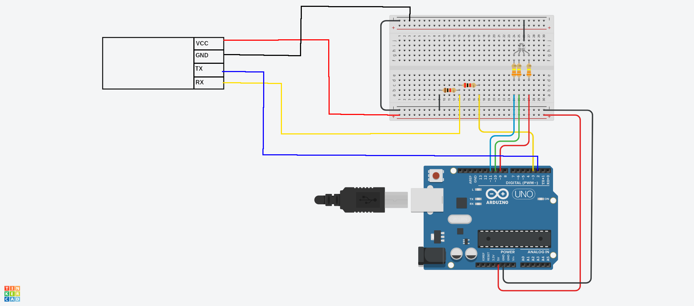

# RGB LED color control with Bluetooth
Program for wireless RGB LED color control. Hexadecimal RGB codes can be sent via bluetooth. Each code must start with begin and end delimiter, for example:
```
<FF0000>
```
where `<` and `>` are delimiters.

## YouTube video
[](https://youtu.be/mMHLewlSawA)

## Software
- [Serial Bluetooth Terminal](https://play.google.com/store/apps/details?id=de.kai_morich.serial_bluetooth_terminal&hl=pl&gl=US)

## Diagram
