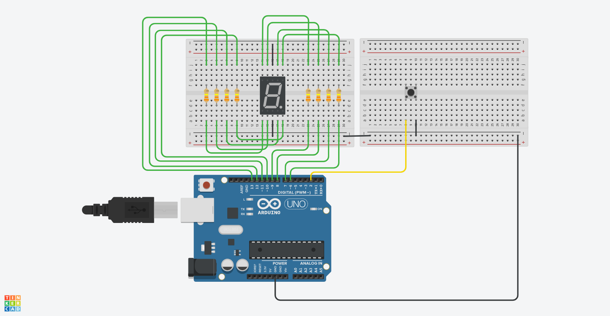

# Seven segment display

The program loops through the numbers from 0 to 9 and displays them on 7-segment display. After pressing the button, program will show a simple animation and when you release it, program will generate a random number from 0 to 9 and starts counting again starting with that random number.

